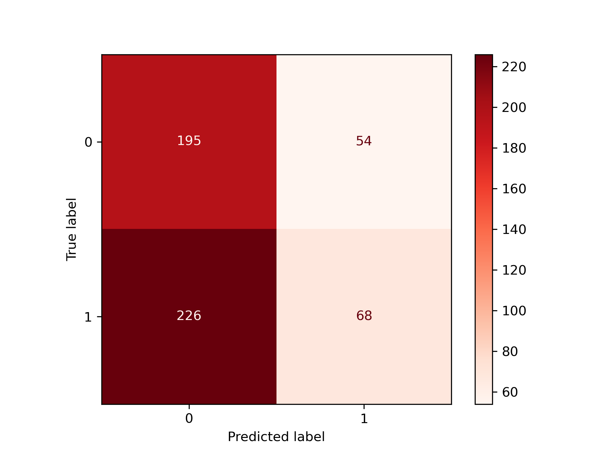

<p align="center">
  
</p>

<h1 align="center">₿ Bitcoin Price Direction Prediction using Machine Learning</h1>

<p align="center">
Predicting the next-day direction of Bitcoin prices using supervised machine learning algorithms, feature engineering, and financial market analysis.
</p>

<p align="center">


</p>

---

# 📖 Project Overview

Bitcoin is one of the world's most volatile financial assets, making the prediction of its price movements a challenging problem in financial analytics and machine learning. Instead of forecasting the exact future price, this project focuses on predicting whether the price of Bitcoin will move **up or down on the next trading day**.

A complete end-to-end machine learning workflow was implemented, beginning with data preprocessing and exploratory data analysis, followed by feature engineering, model training, and comprehensive performance evaluation. Historical Bitcoin market data was transformed into informative predictors that capture market behaviour and improve the learning capability of the models.

Six supervised machine learning algorithms were trained and compared using multiple evaluation metrics, including Accuracy, Precision, Recall, F1-Score, and ROC-AUC. The project demonstrates how different machine learning techniques perform on a real-world financial prediction task while highlighting the importance of feature engineering and model evaluation in quantitative finance.

---

## 🎯 Key Highlights

- 📈 Predicts the next-day direction of Bitcoin prices.
- 🤖 Compares six supervised machine learning algorithms.
- 📊 Performs Exploratory Data Analysis (EDA).
- ⚙️ Applies feature engineering to financial market data.
- 📉 Evaluates models using multiple classification metrics.
- 📚 Demonstrates a complete end-to-end machine learning workflow.

---

## 🛠 Technologies Used

- Python
- Pandas
- NumPy
- Matplotlib
- Seaborn
- Scikit-learn
- XGBoost
- Jupyter Notebook
-                

# 🎯 Business Problem

Bitcoin is one of the most actively traded cryptocurrencies in the world, characterised by high price volatility and rapidly changing market conditions. Accurately predicting short-term market movements remains a significant challenge due to the complex and non-linear behaviour of financial markets.

Rather than forecasting the exact future price of Bitcoin, this project addresses a binary classification problem by predicting whether the next day's closing price will be **higher or lower** than the current day's closing price. Such predictions can provide valuable insights for traders, investors, and researchers seeking to understand market behaviour and evaluate data-driven trading strategies.

This project investigates whether supervised machine learning algorithms can identify meaningful patterns from historical market data and engineered financial features to improve the prediction of Bitcoin price direction.

# 🎯 Project Objectives

The primary objectives of this project are to:

- Develop an end-to-end machine learning pipeline for Bitcoin price direction prediction.
- Perform exploratory data analysis to understand the characteristics of the dataset.
- Engineer informative financial features from historical Bitcoin market data.
- Train multiple supervised machine learning models for binary classification.
- Compare model performance using multiple evaluation metrics.
- Identify the strengths and limitations of each machine learning algorithm.
- Provide recommendations for improving predictive performance in future work.
# 📂 Dataset

The dataset consists of historical Bitcoin market data containing daily trading information. Each observation includes the following market variables:

- Date
- Open Price
- High Price
- Low Price
- Close Price
- Adjusted Close Price
- Trading Volume

Additional predictive variables were generated through feature engineering to capture market behaviour more effectively. These engineered features provide the machine learning models with additional information beyond the original market variables.
# 🔄 Project Workflow

```text
Historical Bitcoin Market Data
            │
            ▼
     Data Preprocessing
            │
            ▼
Exploratory Data Analysis
            │
            ▼
    Feature Engineering
            │
            ▼
      Train-Test Split
            │
            ▼
 Machine Learning Models
            │
            ▼
   Performance Evaluation
            │
            ▼
    Model Comparison
            │
            ▼
  Best Performing Model
```
# 📊 Exploratory Data Analysis (EDA)

Before training the machine learning models, exploratory data analysis (EDA) was performed to understand the characteristics of the dataset, identify relationships between variables, and uncover patterns that could influence model performance.

The analysis focused on data quality, target distribution, feature relationships, and the statistical behaviour of the engineered financial variables.
## 📈 Class Distribution

<p align="center">
  
</p>

### Observation

The target variable exhibits a relatively balanced distribution between upward and downward Bitcoin price movements. This balanced class distribution reduces the likelihood of model bias towards a single class and allows evaluation metrics such as Accuracy, Precision, Recall, and F1-Score to provide meaningful performance comparisons.
## 🔥 Correlation Heatmap

<p align="center">
  
</p>

### Observation

The correlation heatmap illustrates the relationships among the numerical variables within the dataset. Strong positive correlations were observed between the Open, High, Low, Close, and Adjusted Close prices, reflecting their shared dependence on daily market movements. These insights informed the feature engineering process by highlighting which variables contain complementary information for predicting Bitcoin price direction.
## 📉 Confusion Matrix

<p align="center">
  
</p>

### Observation

The confusion matrix provides a detailed summary of the classification performance by comparing predicted labels with the actual outcomes. It highlights the number of correctly classified observations alongside false positives and false negatives, enabling a deeper assessment of the model beyond overall accuracy.
